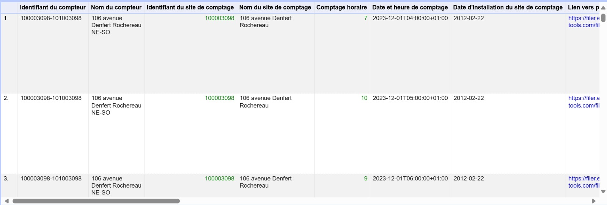
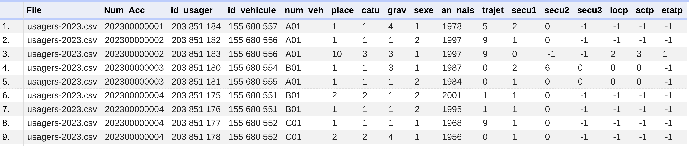
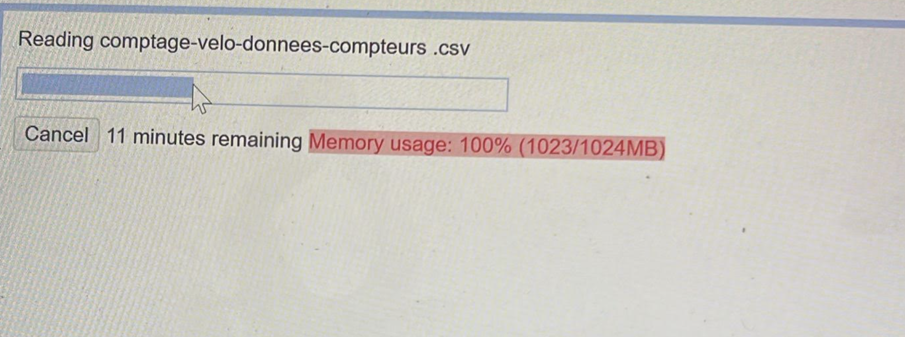

# Bike Accident Analysis — Vizionaries

Projet de visualisation d'information interactive cherchant à répondre à la question :

> **Comment le développement et la qualité des infrastructures cyclables impactent-ils la fréquence et la gravité des accidents de vélo à travers les régions françaises ?**

## Contexte

Ce projet s'inscrit dans une démarche de compréhension de l'impact des infrastructures cyclables sur la sécurité des cyclistes, en croisant plusieurs jeux de données officiels français couvrant la période **2005–2023**.

## Jeux de données utilisés

| Dataset | Source | Description |
|---|---|---|
| **BAAC** (Bulletin d'Analyse des Accidents Corporels) | Ministère de l'Intérieur | Base officielle des accidents corporels de la circulation (localisation, gravité, circonstances) |
| **Paris Traffic Data** | Paris Open Data Portal | Comptage horaire du trafic cycliste via compteurs automatiques |
| **Météo-France** | Météo-France | Conditions météorologiques historiques pouvant influencer la sécurité des cyclistes |

Le dataset principal (**BAAC**) a été retenu pour sa fiabilité — collecté par les forces de l'ordre et les autorités de transport — puis enrichi avec les données de trafic parisien et météo.

## Évolution de la question de recherche

Le projet s'est d'abord concentré sur les infrastructures cyclables à proximité des stations de vélo en libre-service (type Vélib), avant d'élargir le périmètre à **l'ensemble des cyclistes**, faute de données distinguant clairement les usagers de services de partage des cyclistes réguliers.

## Nettoyage des données

- **BAAC** : filtrage pour ne conserver que les accidents impliquant des vélos, restriction à la région parisienne, fusion des multiples fichiers (structure proche d'une base SQL avec tables séparées pour caractéristiques, lieux, véhicules, usagers)
- **Paris Open Data / Météo-France** : peu de nettoyage nécessaire, suppression des colonnes non pertinentes (ex. URLs photo des compteurs)
- ⚠️ Limite rencontrée : dépassement de mémoire lors du traitement du Paris Open Data Portal — fusion complète des datasets encore à finaliser

## Aperçu

**Paris Open Data Portal** — données de comptage vélo :

**Dataset BAAC** — données d'accidents nettoyées :

**Limite mémoire rencontrée** lors du traitement des données :

## Accès aux données

Les datasets complets sont disponibles sur le Drive partagé de l'équipe (lien dans le rapport original).

## Équipe Vizionaries

- BOUSALEM Mouad
